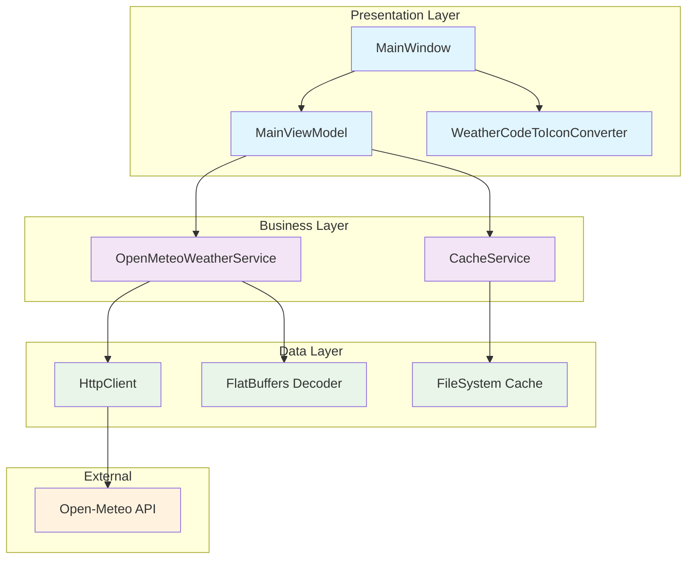
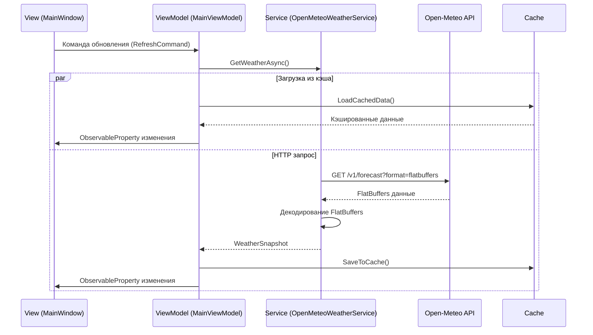
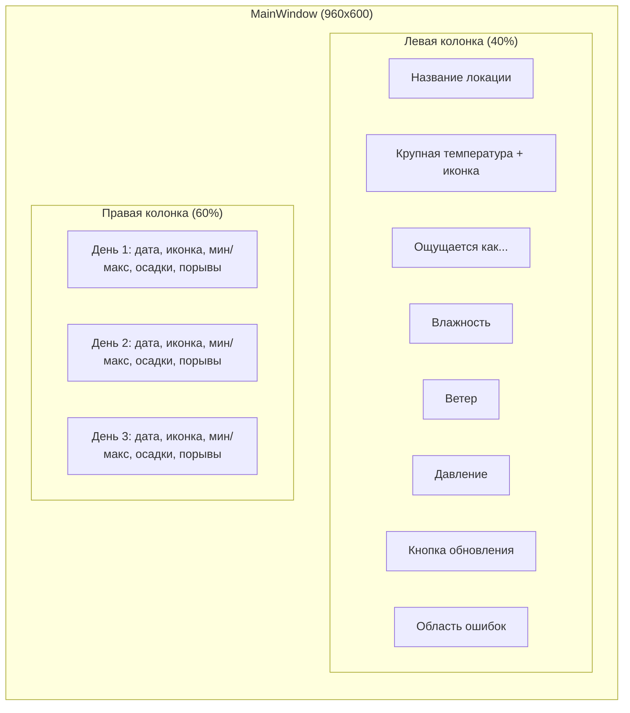
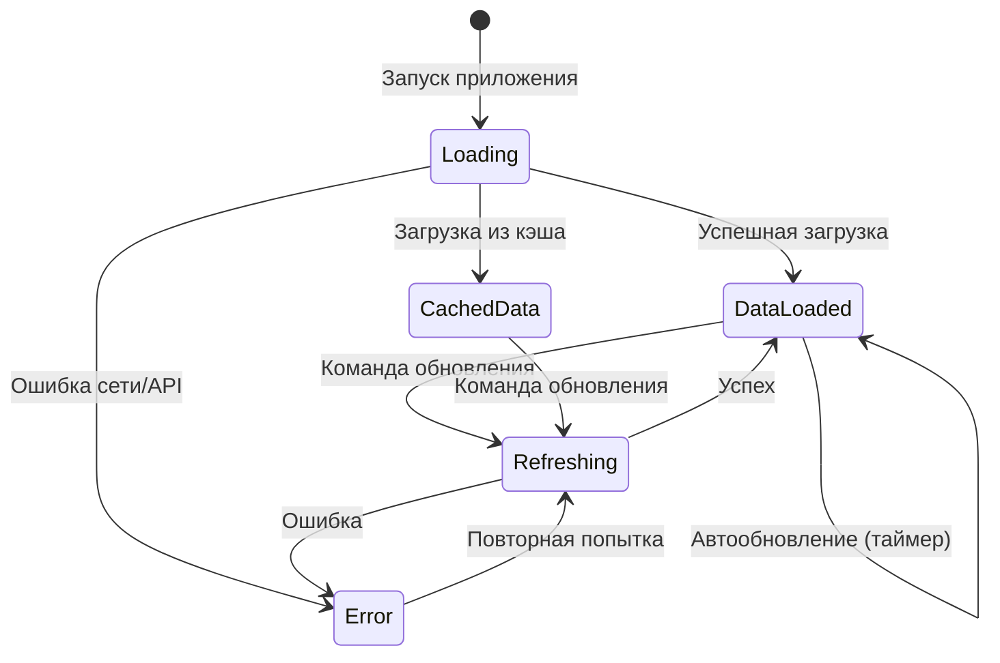
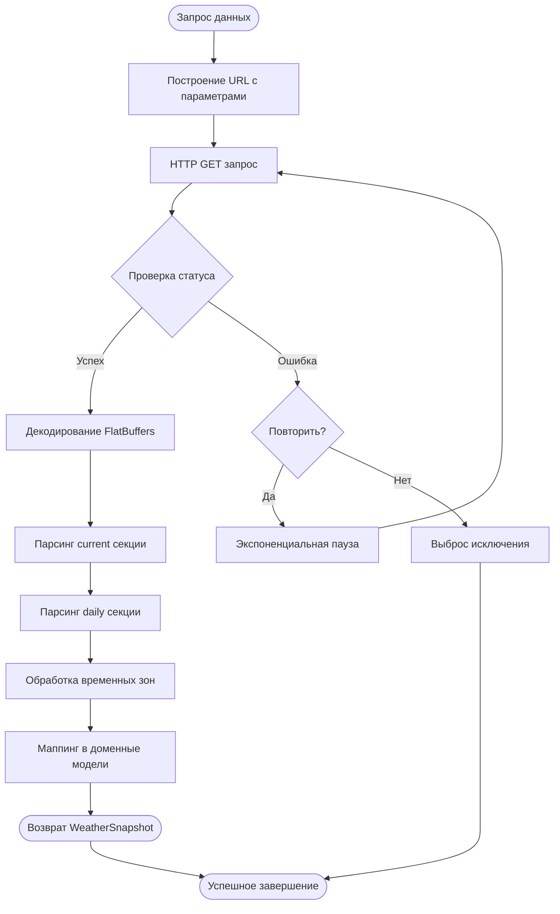
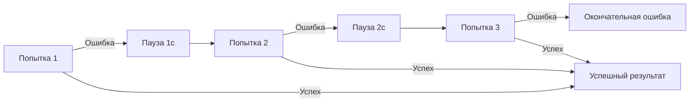

# Дизайн-документ: Настольное WPF-приложение "Chuhuiv Weather"

## Обзор

### Назначение системы
Настольное WPF-приложение для отображения актуальной погодной информации и прогноза на 3 дня для города Чугуев, Харьковская область, Украина. Приложение использует Open-Meteo Forecast API с FlatBuffers форматом для оптимальной производительности.

### Основные функции
- Отображение текущих погодных условий (температура, ощущаемая температура, влажность, ветер, облачность, давление)
- Прогноз погоды на ближайшие 3 дня с детализацией по ключевым параметрам
- Автоматическое обновление данных с настраиваемым интервалом
- Кэширование последних данных для работы в оффлайн-режиме
- Локализация интерфейса на русском/украинском языках

### Целевая аудитория
Жители города Чугуев и окрестностей, нуждающиеся в актуальной погодной информации для планирования повседневной деятельности.

## Технологический стек и зависимости

### Основные технологии
- **.NET 9** - целевая платформа
- **WPF (Windows Presentation Foundation)** - UI фреймворк
- **C# 13** - язык программирования
- **MVVM архитектурный паттерн** с CommunityToolkit.Mvvm

### Внешние зависимости
| Пакет | Версия | Назначение |
|-------|--------|------------|
| `openmeteo_sdk` | 1.18.6+ | FlatBuffers схемы для Open-Meteo API |
| `Google.FlatBuffers` | Транзитивная | Сериализация/десериализация данных |
| `CommunityToolkit.Mvvm` | Актуальная | MVVM паттерн, ObservableObject, RelayCommand |
| `Serilog` | Опционально | Структурированное логирование |
| `Serilog.Sinks.File` | Опционально | Запись логов в файлы |

### Источник данных
**Open-Meteo Forecast API**
- Endpoint: `https://api.open-meteo.com/v1/forecast`
- Формат данных: FlatBuffers
- Географические координаты: `lat=49.836626`, `lon=36.689939`
- Часовой пояс: `Europe/Kyiv`
- Лицензия: Бесплатное некоммерческое использование

## Архитектура приложения

### Структура проекта
```
/src/ChuhuivWeather.App/
├── App.xaml, App.xaml.cs                    # Точка входа приложения
├── Views/
│   └── MainWindow.xaml, MainWindow.xaml.cs # Главное окно
├── ViewModels/
│   └── MainViewModel.cs                     # Основная модель представления
├── Services/
│   └── OpenMeteoWeatherService.cs           # Сервис интеграции с API
├── Models/
│   └── WeatherModels.cs                     # Доменные модели
├── Converters/
│   └── WeatherCodeToIconConverter.cs        # Конвертеры для UI
├── Assets/
│   └── Icons/*.png                          # Иконки погодных условий
└── Infrastructure/
    └── Http/
        └── HttpClientFactory.cs             # Фабрика HTTP клиентов
```

### Компонентная диаграмма



### MVVM архитектурные потоки



## API интеграция

### Параметры запроса к Open-Meteo
| Параметр | Значение | Описание |
|----------|----------|----------|
| `latitude` | 49.836626 | Широта Чугуева |
| `longitude` | 36.689939 | Долгота Чугуева |
| `timezone` | Europe/Kyiv | Часовой пояс |
| `forecast_days` | 3 | Количество дней прогноза |
| `format` | flatbuffers | Формат ответа |

### Текущие условия (current параметры)
- `temperature_2m` - температура на высоте 2м
- `apparent_temperature` - ощущаемая температура
- `relative_humidity_2m` - относительная влажность
- `weather_code` - код погодных условий (WMO)
- `cloud_cover` - облачность в процентах
- `pressure_msl` - давление на уровне моря
- `wind_speed_10m` - скорость ветра на высоте 10м
- `wind_direction_10m` - направление ветра
- `wind_gusts_10m` - порывы ветра

### Ежедневный прогноз (daily параметры)
- `weather_code` - код погодных условий
- `temperature_2m_max` - максимальная температура
- `temperature_2m_min` - минимальная температура
- `precipitation_sum` - сумма осадков
- `wind_gusts_10m_max` - максимальные порывы ветра

### Пример URL запроса
```
https://api.open-meteo.com/v1/forecast?
latitude=49.836626&longitude=36.689939&
timezone=Europe/Kyiv&forecast_days=3&format=flatbuffers&
current=temperature_2m,apparent_temperature,relative_humidity_2m,weather_code,cloud_cover,pressure_msl,wind_speed_10m,wind_direction_10m,wind_gusts_10m&
daily=weather_code,temperature_2m_max,temperature_2m_min,precipitation_sum,wind_gusts_10m_max
```

## Модели данных

### Доменные модели

#### CurrentConditions
Представляет текущие погодные условия:
| Поле | Тип | Описание |
|------|-----|----------|
| TimeLocal | DateTimeOffset | Локальное время измерения |
| TemperatureC | double | Температура в градусах Цельсия |
| ApparentTemperatureC | double | Ощущаемая температура |
| RelativeHumidityPct | int | Относительная влажность (%) |
| WeatherCode | int | WMO код погодных условий |
| CloudCoverPct | int | Облачность (%) |
| PressureMslHpa | double | Давление на уровне моря (гПа) |
| WindSpeedKmh | double | Скорость ветра (км/ч) |
| WindDirectionDeg | int | Направление ветра (градусы) |
| WindGustKmh | double | Порывы ветра (км/ч) |

#### DailyForecast
Представляет прогноз на один день:
| Поле | Тип | Описание |
|------|-----|----------|
| DateLocal | DateOnly | Дата прогноза |
| WeatherCode | int | WMO код погодных условий |
| TminC | double | Минимальная температура |
| TmaxC | double | Максимальная температура |
| PrecipitationSumMm | double | Сумма осадков (мм) |
| WindGustMaxKmh | double | Максимальные порывы ветра |

#### WeatherSnapshot
Агрегирует полную информацию о погоде:
| Поле | Тип | Описание |
|------|-----|----------|
| LocationName | string | Название локации |
| Current | CurrentConditions | Текущие условия |
| Next3Days | IReadOnlyList<DailyForecast> | Прогноз на 3 дня |

### Маппинг WMO Weather Codes

| Код | Описание | Иконка/Emoji |
|-----|----------|--------------|
| 0 | Ясно | ☀️ |
| 1-3 | Переменная облачность | 🌤️/☁️ |
| 45, 48 | Туман | 🌫️ |
| 51, 53, 55 | Морось | 🌦️ |
| 61, 63, 65 | Дождь | 🌧️ |
| 71, 73, 75 | Снег | 🌨️ |
| 80, 81, 82 | Ливни | 🌧️ |
| 95 | Гроза | ⛈️ |

## Архитектура пользовательского интерфейса

### Компоненты главного окна

#### Левая панель - Текущие условия
- **Заголовок локации**: "Chuhuiv, Kharkiv Oblast"  
- **Крупная температура**: Размер шрифта 56px, полужирный
- **Иконка погоды**: 56px, основанная на WMO коде
- **Ощущаемая температура**: "Ощущается как {температура}°C"
- **Дополнительные параметры**:
  - Влажность в процентах
  - Скорость ветра в км/ч  
  - Давление в гПа
  - Облачность в процентах
- **Кнопка обновления**: Привязана к RefreshCommand
- **Область ошибок**: Отображение сетевых/API ошибок

#### Правая панель - Прогноз на 3 дня
Для каждого дня отображается:
- **Дата**: Формат "пн, 25 дек"
- **Иконка погоды**: 28px
- **Диапазон температур**: "мин {мин}° макс {макс}°"
- **Осадки**: "осадки {количество} мм"  
- **Максимальные порывы**: "порывы {скорость} км/ч"

### Макет окна



### Стилизация и темы
- **Базовая тема**: Светлая с возможностью добавления темной
- **Цветовая схема**: Нейтральные тона с акцентами для важной информации
- **Типографика**: Segoe UI, адаптивные размеры шрифтов
- **Закругленные углы**: 12-16px для карточек прогноза
- **Отступы**: 16-24px для основных элементов

## Управление состоянием

### MainViewModel структура
Использует CommunityToolkit.Mvvm с следующими свойствами:

| Свойство | Тип | Назначение |
|----------|-----|------------|
| IsBusy | bool | Индикатор загрузки данных |
| Location | string | Название локации |
| Snapshot | WeatherSnapshot? | Текущие погодные данные |
| Error | string? | Сообщение об ошибке |
| LastUpdated | DateTimeOffset? | Время последнего обновления |

### Команды
- **RefreshCommand** (AsyncRelayCommand): Обновление погодных данных
- **ToggleAutoRefreshCommand** (RelayCommand): Включение/отключение автообновления

### Состояния интерфейса



## Сервисный слой

### OpenMeteoWeatherService архитектура

#### Основные обязанности
1. **Формирование HTTP запросов** к Open-Meteo API
2. **Декодирование FlatBuffers** ответов через openmeteo_sdk
3. **Маппинг** FlatBuffers структур в доменные модели
4. **Обработка ошибок** и повторных попыток
5. **Логирование** запросов и ответов

#### Алгоритм обработки данных



### Кэширование данных

#### Стратегия кэширования
- **Локация кэша**: `%LOCALAPPDATA%\ChuhuivWeather\cache.bin`
- **Формат**: JSON сериализация через System.Text.Json
- **Время жизни**: 30 минут для текущих условий, 24 часа для прогноза
- **Поведение при старте**: Показ кэшированных данных с параллельным обновлением

#### Структура кэша
| Поле | Тип | Описание |
|------|-----|----------|
| Data | WeatherSnapshot | Кэшированные погодные данные |
| Timestamp | DateTimeOffset | Время сохранения |
| ExpiresAt | DateTimeOffset | Время истечения кэша |

## Обработка ошибок и устойчивость

### Типы ошибок и стратегии обработки

| Тип ошибки | Стратегия | Действие пользователя |
|------------|-----------|----------------------|
| Сетевая ошибка | 2 повторные попытки с паузой | Показ кэшированных данных |
| Таймаут HTTP | Увеличение таймаута до 10с | Сообщение "Медленное соединение" |
| Ошибка API | Логирование, показ ошибки | Кнопка "Повторить" |
| Ошибка парсинга | Логирование, fallback к JSON | Техническое сообщение об ошибке |

### Паттерн повторных попыток



### Логирование событий
- **Уровень INFO**: Успешные обновления данных
- **Уровень WARN**: Ошибки сети с восстановлением
- **Уровень ERROR**: Критические ошибки парсинга
- **Уровень DEBUG**: Детали HTTP запросов/ответов

## Локализация и интернационализация

### Поддерживаемые языки
- **Русский** (ru-RU) - основной
- **Украинский** (uk-UA) - дополнительный

### Локализуемые элементы
| Элемент | Пример (RU) | Пример (UK) |
|---------|-------------|-------------|
| Заголовок окна | "Погода в Чугуеве" | "Погода у Чугуєві" |
| Ощущаемая температура | "Ощущается как" | "Відчувається як" |
| Влажность | "Влажность" | "Вологість" |
| Ветер | "Ветер" | "Вітер" |
| Давление | "Давление" | "Тиск" |
| Кнопка обновления | "Обновить" | "Оновити" |

### Форматирование данных
- **Температура**: Всегда в градусах Цельсия (°C)
- **Скорость ветра**: км/ч
- **Давление**: гПа (гектопаскали)
- **Осадки**: мм
- **Даты**: Локализованный формат (пн, 25 дек)
- **Время**: 24-часовой формат

## Производительность и оптимизация

### Стратегии оптимизации

#### FlatBuffers преимущества
- **Нулевое копирование**: Прямой доступ к данным без десериализации
- **Меньший размер**: Компактное представление по сравнению с JSON
- **Высокая скорость**: Оптимальная производительность для частых обновлений

#### Управление памятью
- **Слабые ссылки**: Для предотвращения утечек памяти в биндингах
- **Disposal pattern**: Корректное освобождение HTTP клиентов
- **Кэш-стратегия**: Ограничение размера кэша временными рамками

#### Сетевые оптимизации
- **HTTP Keep-Alive**: Переиспользование соединений
- **Таймауты**: 10 секунд для предотвращения зависания
- **Параллельная загрузка**: Кэш показывается во время обновления

### Мониторинг производительности
| Метрика | Целевое значение | Способ измерения |
|---------|------------------|------------------|
| Время запуска | < 2 секунды | От App.OnStartup до первого UI |
| Время обновления | < 5 секунд | От команды до отображения данных |
| Использование памяти | < 50 МБ | Профилировщик в рабочем режиме |
| Размер кэша | < 10 МБ | Размер файла cache.bin |

## Безопасность и конфиденциальность

### Сетевая безопасность
- **HTTPS обязательно**: Все запросы к Open-Meteo через защищенное соединение
- **Валидация сертификатов**: Проверка SSL/TLS сертификатов API
- **Таймауты запросов**: Предотвращение DoS атак

### Обработка данных
- **Никаких персональных данных**: Только географические координаты города
- **Локальное хранение**: Кэш сохраняется только на локальной машине
- **Минимальные права**: Приложение не требует административных привилегий

### Валидация входных данных
- **Проверка ответов API**: Валидация структуры FlatBuffers данных
- **Диапазоны значений**: Проверка разумности температур, давления, влажности
- **Обработка некорректных данных**: Graceful degradation при частично поврежденных данных

## Тестирование

### Модульные тесты

#### OpenMeteoWeatherService тесты
- **Тест парсинга FlatBuffers**: Использование мок-файла ответа API
- **Тест маппинга данных**: Корректность преобразования API ответа в доменные модели
- **Тест обработки ошибок**: Различные сценарии сетевых ошибок
- **Тест повторных попыток**: Проверка экспоненциального backoff

#### Конвертеры тестирование
- **WeatherCodeToIconConverter**: Проверка маппинга всех WMO кодов
- **Граничные случаи**: Неизвестные коды погоды
- **Локализация**: Тестирование на разных культурах

#### Кэширование тесты
- **Сохранение и загрузка**: Корректность сериализации/десериализации
- **Истечение срока**: Поведение при устаревших данных
- **Повреждение кэша**: Восстановление при поврежденных файлах

### Интеграционные тесты
- **Реальный API запрос**: Тест с фиксированными координатами Чугуева
- **Проверка не пустых значений**: Валидация полученных погодных данных
- **Тест полного цикла**: От HTTP запроса до отображения в UI

### UI тестирование
- **Автоматизация команд**: Тестирование RefreshCommand
- **Биндинги данных**: Корректность отображения всех свойств
- **Состояния загрузки**: Проверка индикаторов IsBusy
- **Обработка ошибок**: Отображение сообщений об ошибках

### Тестовые данные
| Сценарий | Ожидаемый результат |
|----------|--------------------|
| Нормальные погодные условия | Все поля заполнены корректными значениями |
| Экстремальные температуры | Корректное отображение отрицательных/высоких значений |
| Нулевые осадки | Отображение "0 мм" вместо пустого значения |
| Сильный ветер | Корректное отображение высоких скоростей |

## Развертывание и дистрибуция

### Системные требования
- **Операционная система**: Windows 10 версии 1809 или новее
- **.NET Runtime**: .NET 9.0 Desktop Runtime
- **Память**: Минимум 100 МБ свободной оперативной памяти
- **Дисковое пространство**: 50 МБ для установки + 10 МБ для кэша
- **Сеть**: Подключение к интернету для получения данных

### Стратегия упаковки
- **Self-contained deployment**: Включение .NET runtime в дистрибутив
- **Single-file publish**: Единый исполняемый файл
- **Compression**: Сжатие для уменьшения размера дистрибутива
- **Trimming**: Удаление неиспользуемых частей .NET runtime

### Установка и конфигурация
| Элемент | Локация | Описание |
|---------|---------|----------|
| Исполняемый файл | `%ProgramFiles%\ChuhuivWeather\` | Основное приложение |
| Кэш данных | `%LOCALAPPDATA%\ChuhuivWeather\` | Сохраненные погодные данные |
| Логи | `%LOCALAPPDATA%\ChuhuivWeather\logs\` | Файлы журналов |
| Настройки | `%LOCALAPPDATA%\ChuhuivWeather\settings.json` | Пользовательские настройки |

### Автоматическое обновление
- **Проверка версий**: При запуске приложения
- **Загрузка обновлений**: В фоновом режиме
- **Установка**: При следующем запуске приложения
- **Откат**: Возможность вернуться к предыдущей версии

## Мониторинг и обслуживание

### Логирование событий

#### Структура логов
```
logs/
├── app-{date}.log          # Основные события приложения
├── weather-{date}.log      # Специфичные для погодного сервиса
└── errors-{date}.log       # Только ошибки и исключения
```

#### Категории событий
| Уровень | События | Пример сообщения |
|---------|---------|------------------|
| Information | Успешные обновления | "Weather data updated successfully for Chuhuiv" |
| Warning | Fallback к кэшу | "Using cached data due to network timeout" |
| Error | Ошибки API | "Failed to parse FlatBuffers response" |
| Debug | HTTP детали | "HTTP GET completed in 1.2s, response size: 4KB" |

### Диагностика проблем

#### Типовые проблемы и решения
| Проблема | Симптом | Решение |
|----------|---------|----------|
| Отсутствие данных | Пустой интерфейс | Проверить подключение к интернету |
| Устаревшие данные | Старые временные метки | Принудительное обновление |
| Медленная загрузка | Долгий спиннер | Увеличить таймауты HTTP |
| Ошибки парсинга | Сообщения об ошибках | Обновить openmeteo_sdk |

### Аналитика использования
- **Счетчики запросов**: Количество обновлений данных
- **Время отклика**: Производительность API запросов
- **Частота ошибок**: Мониторинг стабильности
- **Использование кэша**: Эффективность офлайн режима

## Соответствие требованиям и лицензирование

### Лицензионные ограничения
- **Open-Meteo API**: Бесплатное некоммерческое использование
- **Коммерческое использование**: Требует платного плана и API ключа
- **Ограничения запросов**: 10,000 запросов в день для бесплатного использования
- **Attribution**: Желательно указание источника данных в интерфейсе

### Соблюдение рекомендаций Open-Meteo
- **Частота запросов**: Не чаще 1 раза в час для прогнозных данных
- **Кэширование обязательно**: Минимизация нагрузки на API
- **User-Agent header**: Идентификация приложения в HTTP запросах
- **Graceful degradation**: Работа при ограничении API

### Конфиденциальность
- **Никаких персональных данных**: Приложение не собирает информацию о пользователях
- **Только географические координаты**: Фиксированная локация Чугуева
- **Локальное хранение**: Все данные остаются на устройстве пользователя
- **Никакой телеметрии**: Отсутствие отправки данных об использовании