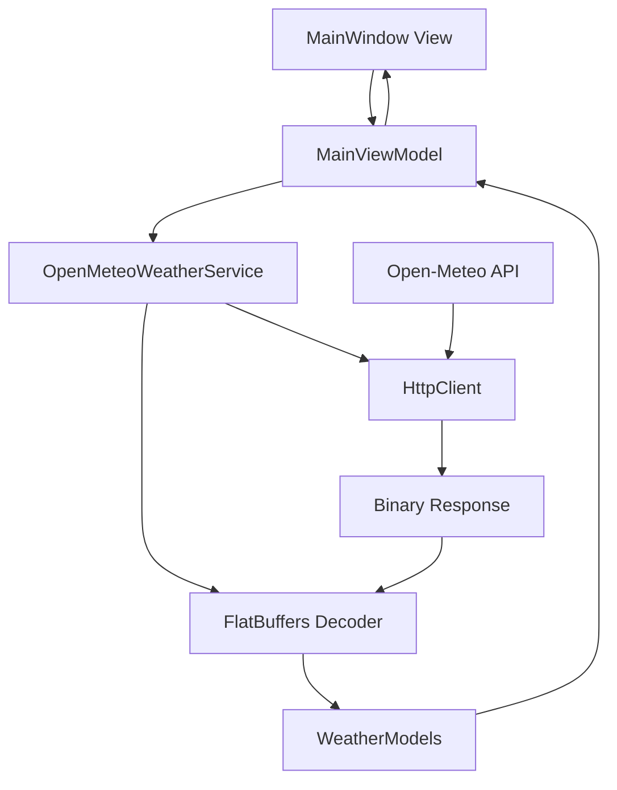
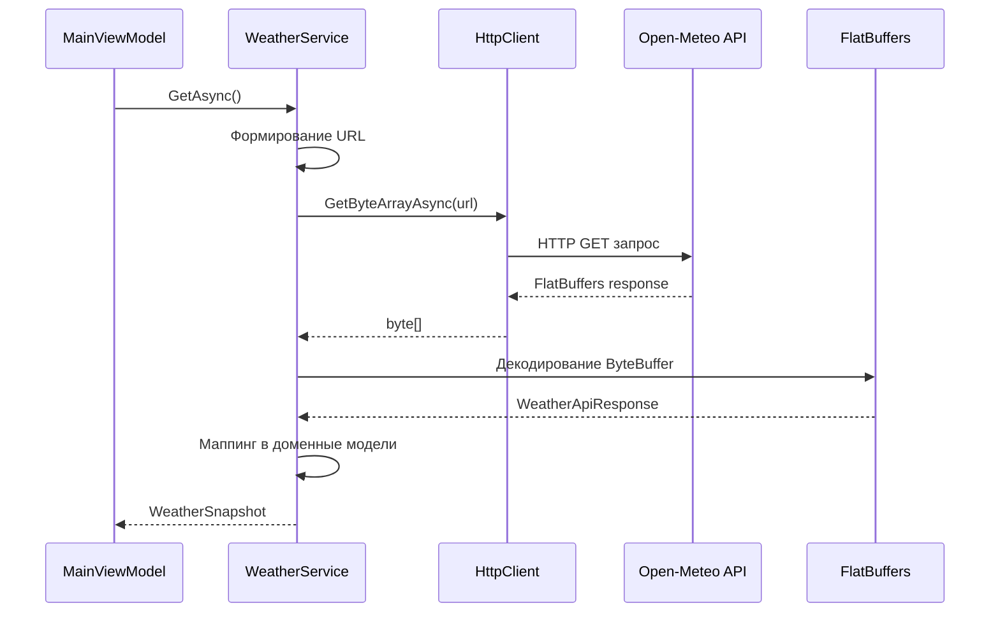
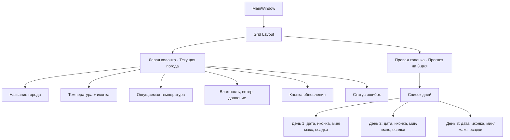

# Техническое задание: WPF-приложение погоды для Чугуева

## Обзор

Настольное WPF-приложение для отображения актуальной погоды и краткосрочного прогноза для города Чугуев (Харьковская область, Украина). Приложение использует Open-Meteo API с FlatBuffers форматом для эффективного получения метеоданных без необходимости регистрации и API-ключей.

### Основные характеристики
- **Цель**: Отображение текущих погодных условий и прогноза на 3 дня
- **Платформа**: Windows Desktop (WPF)
- **Технологический стек**: .NET 9, WPF, C# 13
- **Архитектурный паттерн**: MVVM
- **Источник данных**: Open-Meteo Forecast API с FlatBuffers

## Технологический стек и зависимости

### Основные технологии
- **.NET 9** - целевая платформа
- **WPF** - пользовательский интерфейс
- **C# 13** - язык программирования
- **MVVM** - архитектурный паттерн с CommunityToolkit.Mvvm

### NuGet-пакеты
| Пакет | Назначение | Обязательность |
|-------|------------|----------------|
| `openmeteo_sdk` | FlatBuffers схемы от Open-Meteo | Обязательный |
| `Google.FlatBuffers` | Библиотека FlatBuffers (транзитивная зависимость) | Автоматически |
| `CommunityToolkit.Mvvm` | MVVM-инфраструктура, атрибуты, команды | Обязательный |
| `Serilog` + `Serilog.Sinks.File` | Система логирования | Опциональный |

## Архитектура приложения

### Структура проекта
```
/src/ChuhuivWeather.App
├── App.xaml, App.xaml.cs
├── /Views
│   └── MainWindow.xaml, MainWindow.xaml.cs
├── /ViewModels
│   └── MainViewModel.cs
├── /Services
│   └── OpenMeteoWeatherService.cs
├── /Models
│   └── WeatherModels.cs
├── /Converters
│   └── WeatherCodeToIconConverter.cs
├── /Assets/Icons
│   └── *.png (погодные иконки)
└── /Infrastructure/Http
    └── HttpClientFactory.cs
```

### MVVM-архитектура и поток данных



### Слои архитектуры

#### Presentation Layer (View)
- **MainWindow.xaml** - главное окно приложения
- Отображение текущих условий и прогноза
- Обработка пользовательского ввода (кнопка обновления)

#### ViewModel Layer
- **MainViewModel** - управление состоянием UI
- Команды для обновления данных
- Обработка ошибок и состояний загрузки

#### Service Layer
- **OpenMeteoWeatherService** - интеграция с API
- HTTP-запросы и декодирование FlatBuffers
- Маппинг данных в доменные модели

#### Domain Models
- **CurrentConditions** - текущие погодные условия
- **DailyForecast** - прогноз на день
- **WeatherSnapshot** - агрегированная модель данных

## Модели данных

### Основные сущности

#### CurrentConditions
| Поле | Тип | Описание |
|------|-----|----------|
| TimeLocal | DateTimeOffset | Локальное время измерения |
| TemperatureC | double | Температура воздуха (°C) |
| ApparentTemperatureC | double | Ощущаемая температура (°C) |
| RelativeHumidityPct | int | Относительная влажность (%) |
| WeatherCode | int | WMO код погоды |
| CloudCoverPct | int | Облачность (%) |
| PressureMslHpa | double | Давление на уровне моря (гПа) |
| WindSpeedKmh | double | Скорость ветра (км/ч) |
| WindDirectionDeg | int | Направление ветра (градусы) |
| WindGustKmh | double | Порывы ветра (км/ч) |

#### DailyForecast
| Поле | Тип | Описание |
|------|-----|----------|
| DateLocal | DateOnly | Дата прогноза |
| WeatherCode | int | WMO код погоды |
| TminC | double | Минимальная температура (°C) |
| TmaxC | double | Максимальная температура (°C) |
| PrecipitationSumMm | double | Сумма осадков (мм) |
| WindGustMaxKmh | double | Максимальные порывы ветра (км/ч) |

#### WeatherSnapshot
| Поле | Тип | Описание |
|------|-----|----------|
| LocationName | string | Название локации |
| Current | CurrentConditions | Текущие условия |
| Next3Days | IReadOnlyList<DailyForecast> | Прогноз на 3 дня |

## Интеграция с Open-Meteo API

### Конфигурация запроса

#### Базовые параметры
- **Endpoint**: `https://api.open-meteo.com/v1/forecast`
- **Координаты**: `latitude=49.836626&longitude=36.689939` (Чугуев)
- **Часовой пояс**: `timezone=Europe/Kyiv`
- **Период прогноза**: `forecast_days=3`
- **Формат**: `format=flatbuffers`

#### Параметры текущих условий (current)
- `temperature_2m` - температура воздуха
- `apparent_temperature` - ощущаемая температура
- `relative_humidity_2m` - относительная влажность
- `weather_code` - код погоды
- `cloud_cover` - облачность
- `pressure_msl` - давление на уровне моря
- `wind_speed_10m` - скорость ветра
- `wind_direction_10m` - направление ветра
- `wind_gusts_10m` - порывы ветра

#### Параметры суточного прогноза (daily)
- `weather_code` - код погоды
- `temperature_2m_max` - максимальная температура
- `temperature_2m_min` - минимальная температура
- `precipitation_sum` - сумма осадков
- `wind_gusts_10m_max` - максимальные порывы ветра

### Алгоритм работы сервиса



### Обработка FlatBuffers ответа

1. **Получение байтов**: HTTP-запрос возвращает бинарные данные
2. **Создание ByteBuffer**: Обертка для FlatBuffers декодера
3. **Декодирование**: Использование `WeatherApiResponse.GetRootAsWeatherApiResponse()`
4. **Извлечение данных**: 
   - `current.variables[]` для текущих условий
   - `daily.variables[]` для прогноза
   - `utc_offset_seconds` для корректировки времени
5. **Маппинг**: Преобразование в доменные модели

## Пользовательский интерфейс

### Структура главного окна



### Отображение текущих условий
- **Крупная температура** с погодной иконкой
- **Ощущаемая температура** под основной
- **Детали**: влажность, скорость ветра, порывы, давление, облачность
- **Время последнего обновления**
- **Кнопка обновления** с индикатором загрузки

### Прогноз на 3 дня
- **Горизонтальные карточки** для каждого дня
- **Информация по дням**:
  - Дата (день недели, число, месяц)
  - Погодная иконка
  - Минимальная и максимальная температура
  - Сумма осадков
  - Максимальные порывы ветра

### Система иконок погоды

#### Маппинг WMO Weather Code

| Код | Описание | Иконка |
|-----|----------|--------|
| 0 | Ясно | ☀️ |
| 1,2,3 | Переменная облачность/пасмурно | 🌤/☁️ |
| 45,48 | Туман | 🌫 |
| 51,53,55 | Морось | 🌦 |
| 61,63,65 | Дождь | 🌧 |
| 71,73,75 | Снег | 🌨 |
| 80,81,82 | Ливни | 🌧 |
| 95 | Гроза | ⛈ |

## Функциональные возможности

### Автоматическое обновление
- **Интервал**: 30-60 минут (согласно рекомендациям Open-Meteo)
- **Настраиваемый таймер** для периодических запросов
- **Ручное обновление** через кнопку интерфейса

### Кэширование данных
- **Локальное хранилище**: `%LOCALAPPDATA%\ChuhuivWeather\cache.bin`
- **Формат**: JSON сериализация через System.Text.Json
- **Стратегия**: Показ кэшированных данных при запуске + фоновое обновление

### Обработка ошибок
- **Сетевые ошибки**: таймаут 5-10 секунд
- **Ретрай логика**: 1-2 попытки с экспоненциальной задержкой
- **Отображение ошибок**: информативные сообщения пользователю
- **Офлайн режим**: работа с кэшированными данными

### Логирование
- **Система**: Serilog с записью в файл
- **Расположение**: `logs/app.log`
- **Уровни**: Information, Warning, Error
- **Ротация**: по размеру и времени

## Локализация и форматирование

### Языковая поддержка
- **Основной язык**: Русский (RU)
- **Дополнительный**: Украинский (UK)
- **Ресурсы**: `Resources/*.resx` файлы

### Единицы измерения
| Параметр | Единица |
|----------|---------|
| Температура | °C (Цельсий) |
| Скорость ветра | км/ч |
| Осадки | мм |
| Давление | гПа |
| Влажность | % |

### Форматирование времени
- **Часовой пояс**: Europe/Kyiv
- **Коррекция**: использование `utc_offset_seconds` из API ответа
- **Формат**: локализованный с учетом системных настроек

## Тестирование

### Модульные тесты
- **FlatBuffers декодирование**: тест с мок-файлом ответа
- **WMO код маппинг**: преобразование кодов в иконки
- **Модели данных**: валидация и сериализация

### Интеграционные тесты
- **Реальные API запросы**: тест с координатами Чугуева
- **Сетевые сценарии**: таймауты и ошибки подключения
- **Кэширование**: сохранение и восстановление данных

### End-to-End тесты
- **UI тестирование**: взаимодействие с главным окном
- **Сценарии пользователя**: обновление данных и обработка ошибок